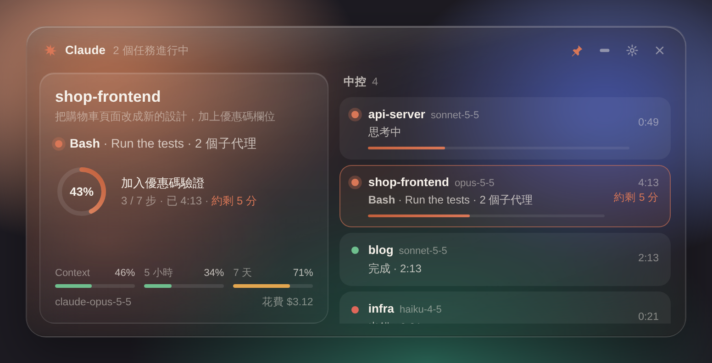

# Claude Code mods

[繁體中文](README.md) · **English**

## context-gauge


A usage gauge for Claude Code, built on [Claude Code Mods](https://x.com/ClaudeCodeLog/status/2105721924470878244) (2.1.287+). The top two bands are the Classic look (mid-task, and close to the limits); the bottom one is the Terminal look.

### What it shows

- **Context**: how full the window is, in percent and tokens; red when auto-compact is near (`compacts soon`).
- **Usage limits**: the 5-hour and weekly windows with reset countdowns, plus this session's cost. Read from Anthropic when the session starts (no need to wait for the first reply), and again any time from ◉ → ↻ Refresh or `/gauge usage` (at most once a minute).
- **While a task runs**: what Claude is doing (thinking, writing, tools) and for how long, tokens per second, the running tool, and a **■ Stop** button.
- **Done notice**: a toast when a turn that took over 20 seconds ends.

### What it does

- **Auto wrap-up** (off by default): separate rules for the 5-hour and weekly windows. When one passes its threshold while a task runs, a 10-second countdown, then a note into the running turn: finish the step, save, write a handoff. Once per window.
- **/compact rule**: past a context percent you set (70% by default), remind you to `/compact`, or compact on its own while idle.
- **Model control**: a draggable capsule slider in Claude's orange, plus the model name. Press the name and a picker opens inside the band: five positions, Fast mode, output style. Each position is a model and an effort level: an alias that follows the latest version (`sonnet`, `opus`…), a 1M variant, a pinned version (`claude-opus-5-5`…), or any id you type. Defaults: Sonnet low → Sonnet high → Opus medium → Opus xhigh → Fable high. Fable stays locked until you turn on "Max plan" in settings.
- **Timeline**: a colored mark on each of your messages (green done, red failed, amber stopped) with a hover card. **History** (≡) lists, per prompt, the time, what you asked and what Claude answered (the opening of each, free), with a filter; a press jumps back to it. One-line AI summaries are off by default (one Haiku call per prompt, uses tokens).
- **Claude status & usage** (◉): claude.ai, the API, Claude Code and the rest, open incidents, and the usage just read. Fetched only when you press ↻ Refresh.
- **You should know**: turn Anthropic's built-in side agent (`cc-plugin-you-should-know@builtin`) on or off.
- **Settings**: `/gauge settings` or ⚙ in the band, in four tabs: Usage, Models, Timeline, Display.

### Looks

- **Classic** (default): deep green, amber and red, drawn as SVG.
- **Minimal**: quiet tones, small caps.
- **Terminal**: the original text bars (`◆ ctx ━━━── │ 5h ▰▱▱▱▱`), always one line, everywhere.
- Text size S / M / L (Classic and Minimal). The SVG follows Claude's theme.

### Install (CLI and Desktop)

```sh
claude plugin marketplace add kirishimarisano-rgb/Claude-code-usage-context-cost-show
claude plugin install context-gauge@kirishima-mods
```

Restart Claude Code afterwards. On Desktop, quit it fully (⌘Q on a Mac, the tray icon on Windows) and open a **local** session in the **Code** tab. To update: `claude plugin marketplace update kirishima-mods`, then `claude plugin update context-gauge@kirishima-mods`.

### Run from a folder instead

```sh
git clone https://github.com/kirishimarisano-rgb/Claude-code-usage-context-cost-show
claude --plugin-dir ./Claude-code-usage-context-cost-show/context-gauge
```

For Claude Code Desktop, which takes no flags, add the folder's absolute path to `env` in `~/.claude/settings.json` and open a local session in the Code tab:

```json
{
  "env": {
    "CLAUDE_CODE_PLUGIN_DIRS": "/Users/you/Claude-code-usage-context-cost-show/context-gauge"
  }
}
```

### Commands

| Command | What it does |
| --- | --- |
| `/gauge` | The gauge in the transcript (a text snapshot where plugin UI is not drawn) |
| `/gauge pane` | The side pane (`f` folds it) |
| `/gauge settings` | Settings |
| `/gauge usage` | Ask Anthropic for the 5-hour and weekly usage now |
| `/gauge status` | Check Claude's service status once |
| `/gauge history` | The History window |
| `/gauge wrap 5h 90\|on\|off` | Auto wrap-up for the 5-hour window |
| `/gauge wrap 7d 95\|on\|off` | Auto wrap-up for the weekly window |
| `/gauge compact 70\|remind\|auto\|off` | When to remind about, or run, /compact |
| `/gauge model` | Open the model picker (inside the band) |
| `/gauge model 1-5` | Switch to a position |
| `/gauge models on\|off` | Show or hide the model control (slider and name together) |
| `/gauge max on\|off` | You have a Max plan (unlocks Fable) |
| `/gauge fast` | Toggle Fast mode |
| `/gauge style [name]` | Next output style, or one by name |
| `/gauge ysk on\|off` | The You should know side agent |
| `/gauge look classic\|minimal\|terminal` | The look |
| `/gauge size s\|m\|l` | Text size (Classic and Minimal) |
| `/gauge summary on\|off` | AI summaries in History (uses tokens) |
| `/gauge marks on\|off` | Timeline marks on your messages |
| `/gauge footer auto\|on\|off` | A usage line under each answer; `auto` shows it only where no band is drawn, as in cloud sessions |

### Cloud sessions (claude.ai/code)

The clients of a cloud session (web, Desktop, mobile) draw no plugin UI, so there is no band or pane. Instead, a usage line goes under each answer, for you only; the model never reads it:

```
🟢 ctx 20%  ·  🟢 5h 12% ↻4h17m  ·  🔴 7d 93% ↻1h47m  ·  $5.01  ·  ⏱ 2m13s (think 40s)  ·  14 tools  ·  52 tok/s
```

To have it in every cloud session, add the two install lines to the environment's **setup script**.

### What it reads and writes

It reads the session's usage, its turns and the clock. It goes online in two places only: the usage check (once at session start, and when you press ↻ Refresh or run `/gauge usage`) and the status check (only on ↻ Refresh). It writes the UI, in-memory state, and its settings in `$.store`. It never reads or writes your project's files and runs no programs.

The output of `/gauge` commands stays in the transcript, where the model can read it (a few dozen to a couple hundred tokens each; `/gauge history` repeats the openings of your earlier messages). The band, panes and the line under each answer are for you only.

Things that change the conversation: ■ Stop; auto wrap-up (a fixed note); the /compact rule set to Auto (compaction makes one model call); and the model, Fast, output style and You should know switches you press (through `/model`, `/effort`, `/fast`, `/plugin` and `/config`). With AI summaries on, each prompt makes one Haiku call.

### Security

- Two outbound requests, both GET:
  - `https://status.claude.com/api/v2/summary.json`: only on ↻ Refresh, no credentials.
  - `https://api.anthropic.com/api/oauth/usage`: at session start (can be turned off in settings), on ↻ Refresh and on `/gauge usage`, at most once a minute. It uses Claude Code's own login: the mod gets an opaque handle, never the token, and Claude Code only sends it to Anthropic.
- The only Claude Code commands it runs are `/model`, `/effort`, `/fast`, `/plugin enable|disable cc-plugin-you-should-know@builtin`, and `/config`'s `outputStyle`. Model ids are limited to letters, digits and `. _ - [ ] :`, checked when typed and again when switching.
- No programs, no project files. The SVGs hold only numbers and fixed labels, never your text or Claude's. Text from the status page and the usage answer is length-capped.
- The wrap-up note and auto /compact are fixed, and off or remind-only by default.

### Known limits

- Cloud-session clients draw no plugin UI: text only (`/gauge` and the line under each answer). A cloud session's login also cannot read usage, so its limits come from replies only.
- Logins with an API key or an enterprise gateway have no 5-hour or weekly windows.
- The mobile app draws no band; the `/gauge` row has buttons.
- The timeline only knows messages since the mod loaded and is cleared on restart; a few turns without a message id cannot jump back.
- The mod cannot see your plan: turn on "Max plan" yourself to unlock Fable.
- Fast mode depends on your account (it may need usage credits).
- Switching models from the slider leaves `/model` and `/effort` lines in the transcript.

### Development

```sh
claude plugin validate context-gauge
claude plugin test context-gauge
```

## Claude Widget (Windows desktop widget)



A liquid-glass widget for the desktop that shows every local Claude Code session at once:

- **Left**: what the chosen session is doing (thinking, writing, which tool), a ring for its task list, time spent and **roughly how long is left**, plus context, 5-hour and weekly usage, and cost.
- **Right, the hub**: one row per session with a status light, what it is doing, a progress bar and times; hover for ■ Stop.
- **Done notice**: a Windows notification when a task over 10 seconds finishes, fails or is stopped.
- Keep it on top or shrink it to a pill; it remembers where you put it. Traditional Chinese and English.

It comes in two parts: the desktop app (`claude-widget/`) and the `widget-bridge` mod, which sends each session's status to it.

### Install

1. **App**: open the latest green run of [Actions → Claude Widget (Windows)](https://github.com/kirishimarisano-rgb/Claude-code-usage-context-cost-show/actions/workflows/widget.yml), download `claude-widget-windows`, unzip it and run the installer. It is not code-signed, so SmartScreen warns: "More info → Run anyway".
2. **Mod**:
   ```sh
   claude plugin install widget-bridge@kirishima-mods
   ```
   If you have not added the marketplace yet, run the first line of the context-gauge install first.
3. **Pair**: open the widget → ⚙, copy the `/widget pair …` line and run it once in Claude Code. Every local session on this computer then shows up.

### Commands

| Command | What it does |
| --- | --- |
| `/widget` | Whether this session reaches the widget |
| `/widget pair <code>` | Pair with the widget |
| `/widget unpair` | Forget the pairing code |
| `/widget on\|off` | Send, or stop sending |
| `/widget port <n>` | The widget's port (47615) |

### How it works, and security

- The mod only POSTs to `http://127.0.0.1:47615`, never to the internet. What it sends: the project folder's name, the first 80 characters of your message, the model, the running tool with a short note (a Bash description or the start of its command, a file name), the task list's titles and progress, context and usage percentages, and cost.
- The app listens on 127.0.0.1 only and takes data only with the pairing code; requests from web pages are refused. At most 64 KB per request and 40 sessions.
- All the app can ask for is "stop this turn of this session"; the mod checks the turn id and ignores anything else.
- Before pairing, the mod sends nothing.

### Limits

- "Roughly how long is left" comes from the share of the task list done; without a task list it shows time spent only.
- Cloud sessions run in the cloud and cannot reach your computer, so they do not show up.
- A notification does not take you back to its session.
- Only a Windows build for now.

## License

[MIT](LICENSE)
