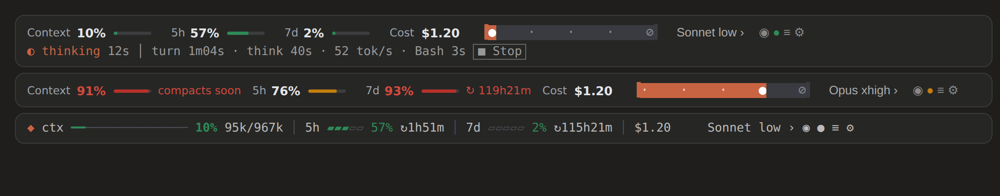

# Claude Code mods

## context-gauge



上面兩條是 Classic 風格（任務進行中、快滿時），最下面是 Terminal 風格。Desktop 和手機 app 用一行高的 SVG 畫用量，字體用系統字體（Windows 是 Segoe UI）；終端與 Terminal 風格用文字畫，永遠一行。

輸入框上方的用量細條，加上可折疊的右側面板。

- **Context**：用量百分比與 token 數，接近自動壓縮門檻時變紅並顯示 `compacts soon`
- **額度**：5h / 7d 用量與重置倒數，以及本次 session 花費
- **任務進行中**：思考、輸出、工具各花的時間，tok/s，工具時間軸，**■ Stop** 按鈕
- **完成通知**：一輪超過 20 秒時，結束會跳 toast
- **自動收尾（預設關閉）**：5h、週額度各自設定開關與門檻；任務進行中達到門檻時倒數 10 秒，然後在正在跑的那一輪插入收尾指示
- **/compact 規則**：context 到設定的百分比時，提醒你 /compact（預設 70%），或閒置時自動 /compact
- **模型切換**：細條上一個可拖的膠囊滑塊（Claude 橘色填到目前檔位、白色圓鈕；可在設定頁單獨隱藏）加模型名稱；按名稱，選擇器在細條內展開：五個檔位、Fast mode、輸出風格，選完自動收起。每一格可選簡稱（sonnet、opus…，跟著最新版）、1M 版本、指定版本（claude-opus-5-5…），或在設定頁輸入任何模型 id。預設 Sonnet low → Sonnet high → Opus medium → Opus xhigh → Fable high；Fable 只給 Max 方案，要在設定頁打開「Max plan」才會解鎖。
- **時間軸**：你每則訊息左邊一條色線（綠完成、紅出錯、黃中止），滑鼠停上去浮出卡片（可在設定頁關閉）。細條上的 ≡ 打開 **History** 視窗：每則訊息的時間、你說了什麼、Claude 做了什麼（各取開頭，不花 token），可篩選，點一下跳回那段對話；AI 一句話摘要預設關閉（每段呼叫一次 Haiku，會用 token）。
- **Claude 服務狀態**：細條上的 ◉ 在細條內展開 claude.ai、API、Claude Code 等服務的狀態與進行中的事件；只有按 ↻ Refresh 才會查詢 status.claude.com。
- **You should know**：Anthropic 內建的側邊 agent（`cc-plugin-you-should-know@builtin`），可在設定頁一鍵開關。
- **設定頁**：`/gauge settings`，或細條旁的 ⚙；分成 Usage / Models / Timeline / Display 四頁

### 安裝（CLI 和 Desktop 都適用）

```sh
claude plugin marketplace add kirishimarisano-rgb/Claude-code-usage-context-cost-show
claude plugin install context-gauge@kirishima-mods
```

裝好後重開 Claude Code。Desktop 要完全結束再開（Mac 用 ⌘Q），然後在 **Code** 分頁開本機 session。更新：`claude plugin marketplace update kirishima-mods`。

### 不安裝、直接從資料夾跑

```sh
git clone https://github.com/kirishimarisano-rgb/Claude-code-usage-context-cost-show
claude --plugin-dir ./Claude-code-usage-context-cost-show/context-gauge
```

**Claude Code Desktop**（不能加參數）：在 `~/.claude/settings.json` 的 `env` 加上 mod 的絕對路徑，然後在 Desktop 的 Code 分頁開一個**本機** session（不是雲端 session）：

```json
{
  "env": {
    "CLAUDE_CODE_PLUGIN_DIRS": "/Users/you/Claude-code-usage-context-cost-show/context-gauge"
  }
}
```

Windows 的路徑寫成 `C:\\Users\\you\\...\\context-gauge`。要改檔後自動重載，再加 `"CLAUDE_CODE_PLUGIN_DIR_WATCH": "1"`。

| 指令 | 作用 |
| --- | --- |
| `/gauge` | 在對話裡顯示儀表（只能顯示文字的客戶端會看到文字快照） |
| `/gauge pane` | 打開右側面板（`f` 折疊/展開） |
| `/gauge settings` | 設定頁 |
| `/gauge wrap 5h 90\|on\|off` | 5 小時額度的自動收尾 |
| `/gauge wrap 7d 95\|on\|off` | 週額度的自動收尾 |
| `/gauge compact 70\|remind\|auto\|off` | context 到幾 % 時提醒或自動 /compact |
| `/gauge look classic\|minimal\|terminal` | 顯示風格：Classic（深綠/深黃/深紅，預設）、Minimal（低飽和）、Terminal（最原本的文字進度條，Desktop 也用文字畫） |
| `/gauge size s\|m\|l` | 文字大小（預設 M） |
| `/gauge model` | 打開模型選擇器（在細條內） |
| `/gauge model 1-5` | 切到第幾格 |
| `/gauge models on\|off` | 顯示或隱藏模型標籤 |
| `/gauge max on\|off` | 你是 Max 方案（解鎖 Fable） |
| `/gauge fast` | 切換 Fast mode |
| `/gauge style [名稱]` | 下一個輸出風格，或指定一個 |
| `/gauge ysk on\|off` | You should know 側邊 agent |
| `/gauge history` | History 視窗 |
| `/gauge status` | 查一次 Claude 服務狀態 |
| `/gauge slider on\|off` | 顯示或隱藏模型滑塊 |
| `/gauge summary on\|off` | 時間軸的 AI 摘要（會用 token） |
| `/gauge marks on\|off` | 訊息上的時間軸色線 |
| `/gauge footer auto\|on\|off` | 每輪回答下附一行用量；`auto`（預設）只在沒有客戶端能畫細條時開啟，例如雲端 session |

上方細條只在終端與 Claude Code Desktop 顯示，手機 app 不顯示。右側面板要在終端全螢幕、寬度 110 欄以上才會停靠在右側。雲端 session 沒有可以畫 mod 介面的客戶端，所以只能看 `/gauge` 的文字快照。

### 雲端 session（claude.ai/code）

連進雲端 session 的客戶端（網頁、Desktop、手機）都不畫 mod 介面，所以沒有上方細條和面板。改成在每輪回答下面附一行用量：

```
🟢 ctx 20%  ·  🟢 5h 12% ↻4h17m  ·  🔴 7d 93% ↻1h47m  ·  $5.01  ·  ⏱ 2m13s (think 40s)  ·  14 tools  ·  52 tok/s
```

這行只顯示給你看，不會進入模型讀到的對話紀錄。

要讓每個雲端 session 都自動裝好，在雲端環境的 **setup script** 加上：

```sh
claude plugin marketplace add kirishimarisano-rgb/Claude-code-usage-context-cost-show
claude plugin install context-gauge@kirishima-mods
```

### 讀寫範圍

只讀 session 用量、每輪事件與時鐘；唯一的連網是你按 ↻ Refresh 時查一次 status.claude.com。寫入只有畫面、記憶體中的狀態，以及保存在 `$.store` 的設定（面板是否折疊、設定頁的各項）。不讀寫專案檔案、不執行程式。

`/gauge` 系列指令的輸出會留在對話紀錄裡，模型讀得到（每次約幾十到一兩百 token；`/gauge history` 會帶出你先前訊息的開頭）。每輪回答下方那一行和所有細條、面板則只給你看。

會影響對話的只有：■ Stop、自動收尾（插入一段收尾提示）、/compact 規則設為 Auto 時的自動壓縮（壓縮本身會呼叫一次模型），以及你按下的模型、Fast、輸出風格、You should know 切換（透過 `/model`、`/effort`、`/fast`、`/plugin` 與 `/config`）。時間軸的 AI 摘要開啟時，每段會呼叫一次 Haiku。

### 安全性

- 對外連線只有一個：你按 ↻ Refresh 時以 GET 讀 `https://status.claude.com/api/v2/summary.json`，不帶任何憑證。
- 會呼叫的 Claude Code 指令固定為 `/model`、`/effort`、`/fast`、`/plugin enable|disable cc-plugin-you-should-know@builtin`，以及 `/config` 的 `outputStyle`；模型 id 只接受英數與 `. _ - [ ] :`，在輸入與切換時各檢查一次。
- 不執行程式、不讀寫專案檔案；SVG 只放數字與固定標籤，不放你或 Claude 的文字；狀態頁回傳的文字有長度上限。
- 自動收尾插入的提示、自動 /compact 都是固定內容，且預設關閉或只提醒。

### 已知限制

- 雲端 session 的客戶端不畫 mod 介面，只有文字（`/gauge` 與回答下方那一行）。
- 手機 app 不畫細條；`/gauge` 那一列有按鈕。
- 時間軸只記得 mod 載入後的訊息，重開 Claude Code 會清空；少數沒有訊息編號的回合不能跳回。
- mod 讀不到你的方案，Fable 檔位要你在設定頁自己打開「Max plan」。
- Fast mode 是否可用取決於帳號（可能需要 usage credits）。
- 用滑塊切換模型時，對話裡會留下 `/model`、`/effort` 的紀錄。

### 開發

```sh
claude plugin validate context-gauge
claude plugin test context-gauge
```
